# QuantumultX 自用配置：一键去广告

> **Quantumult X 自用去广告配置**：自动聚合、更新并本地化常用去广告规则，导入即可使用。

本仓库是我自用的 **Quantumult X 去广告配置（插件集合）**，用于减少 App 开屏、信息流、网页和视频场景中的常见广告。GitHub Actions 每日自动构建：合并自有底包与个人增量配置、把上游规则快照进仓库，保证配置持续更新、稳定可用。

[立即使用本地化配置](https://raw.githubusercontent.com/gclm/QuantumultX/main/QuantumultX_Local.conf) · [镜像加速版](https://testingcf.jsdelivr.net/gh/gclm/QuantumultX@main/QuantumultX_Mirror.conf) · [查看自动构建状态](https://github.com/gclm/QuantumultX/actions)

---

## 🛡️ 它能做什么

- **一键启用常用去广告规则**：集中管理 App、网页、视频等场景的分流与重写规则。
- **覆盖常见应用场景**：项目当前整合了微博、知乎、小红书、哔哩哔哩、高德地图、网易、百度网盘、YouTube、Spotify 等相关规则。
- **每天自动更新**：默认每天北京时间 06:00 自动构建，同步上游规则并重新生成配置，无需手动追更。
- **把远程规则保存到自己的仓库**：降低上游链接失效、限速或变更带来的影响。
- **不包含任何私人信息**：无机场订阅、无证书数据，所有配置和规则公开可审查。
- **不仅能去广告**：同时支持自定义分流、策略组、DNS、MITM、重写和定时任务。

> 去广告效果取决于上游规则、App 版本和 Quantumult X 的 MITM 配置，无法保证覆盖所有广告。部分 HTTPS 重写规则需要安装并信任 Quantumult X 证书后才会生效。

---

## 🚀 导入使用

1. 先备份你当前的 Quantumult X 配置。
2. 复制下面的配置地址（三个地址内容完全相同，只是分发链路不同，按网络可达性任选其一）：

   | 通道 | 配置地址 | 适用场景 |
   |---|---|---|
   | **Raw（主通道）** | `https://raw.githubusercontent.com/gclm/QuantumultX/main/QuantumultX_Local.conf` | 默认首选 |
   | **Mirror（CDN 镜像）** | `https://testingcf.jsdelivr.net/gh/gclm/QuantumultX@main/QuantumultX_Mirror.conf` | Raw 直连不稳时 |
   | **CF（自建反代）** | `https://proxy.991201.xyz/https://raw.githubusercontent.com/gclm/QuantumultX/main/QuantumultX_CF.conf` | 以上均不稳时 |

3. 在 Quantumult X 中打开配置文件管理，选择“下载配置”，粘贴地址并导入。
4. 如需使用 HTTPS 重写规则，请按下一节「配置 Quantumult X」生成、安装并信任 MITM 证书。

`QuantumultX_Local.conf` 会优先引用本仓库保存的规则文件，适合日常使用。导入完整配置可能替换你现有的策略与分流，因此第一步请务必备份。

> **节点订阅不随配置分发**：本配置不包含任何机场订阅链接（策略组通过 `server-tag-regex` 正则自动分组，兼容任意机场）。请在 Quantumult X 的「订阅」区自行添加并维护你的节点订阅。

> **维护与通知配置**：规则定制（`profiles/config.yaml`）、底包跟进、飞书/Telegram 通知的 Secrets 配置方法见 [PROJECT_DOCUMENTATION.md](PROJECT_DOCUMENTATION.md)。

---

## 📱 配置 Quantumult X

完成配置导入、证书安装和功能开关后，HTTPS 去广告规则才能正常工作。不同版本的 Quantumult X 和 iOS 界面可能略有差异，请以实际显示为准。

### 1. 导入配置

打开 Quantumult X，点击右下角的风车图标进入设置页面。

滑动到页面底部的“配置文件”区域，可以看到两种导入方式：

- **下载配置**：粘贴远程地址，直接下载并导入配置。
- **导入配置**：从 iPhone 本地选择已经下载的配置文件。

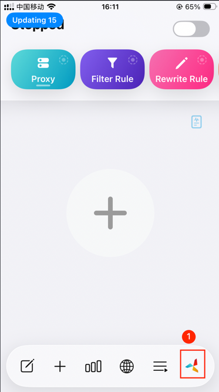 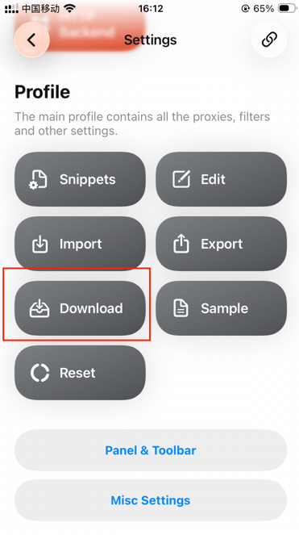

建议先尝试“下载配置”，使用本项目的本地化配置地址：

```text
https://raw.githubusercontent.com/gclm/QuantumultX/main/QuantumultX_Local.conf
```

如果当前网络无法访问 GitHub Raw，可以先在电脑或浏览器中下载 `QuantumultX_Local.conf`，发送到 iPhone 后再选择“导入配置”。

> 导入完整配置可能替换现有的策略组、分流和重写设置，请先备份当前配置。

### 2. 生成并信任 MitM 证书

部分去广告规则需要处理 HTTPS 请求。Quantumult X 只有在安装并信任 MitM 证书后，才能按照规则解密和修改指定域名的 HTTPS 请求与响应。

> MitM 证书权限较高。请只安装由你自己的 Quantumult X 生成的证书，不要安装来历不明的描述文件，也不要向他人分享证书或私钥。

1. 在 Quantumult X 设置页面进入 `MitM`，点击“生成证书”。

    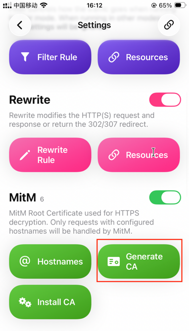  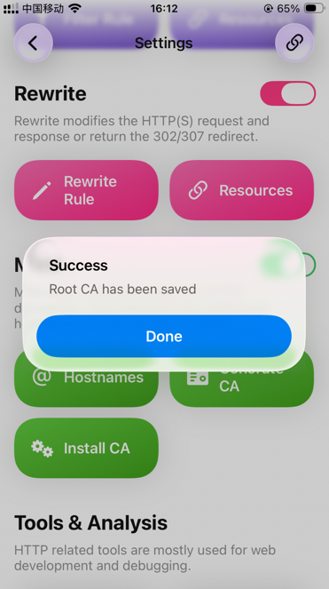

2. 点击“配置证书”，在弹窗中确认继续。

   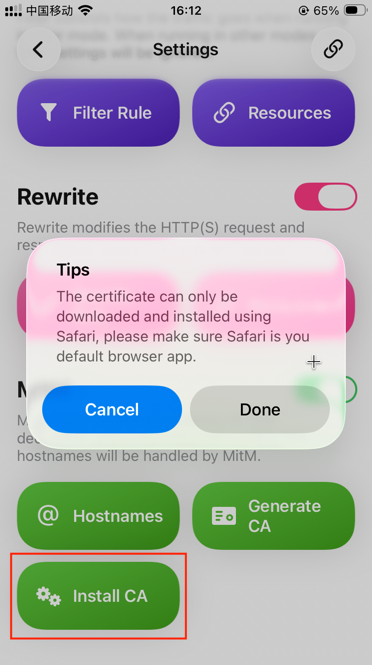

3. 跳转到 Safari 后，点击“允许”下载描述文件。

    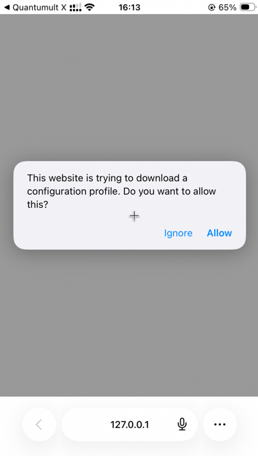 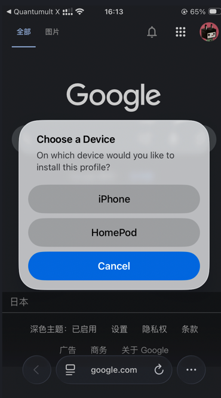

4. Safari 提示描述文件已下载后，返回 iPhone 主屏幕。

5. 打开 iOS“设置”，点击“已下载描述文件”。如果没有看到该入口，可前往“通用”→“VPN 与设备管理”查找。

    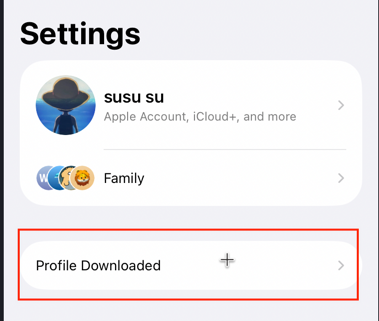

6. 选择 Quantumult X 描述文件并完成安装。系统会要求输入锁屏密码并再次确认。

    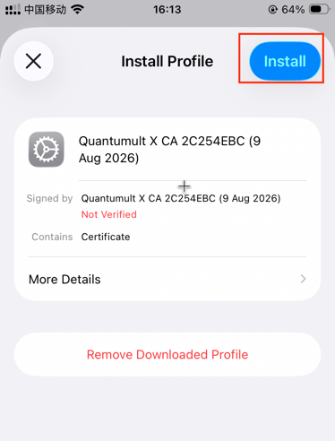

7. 安装完成后，打开“设置”→“通用”→“关于本机”。

8. 滑动到页面底部，进入“证书信任设置”。

9. 找到刚安装的 Quantumult X 根证书，开启完全信任。

    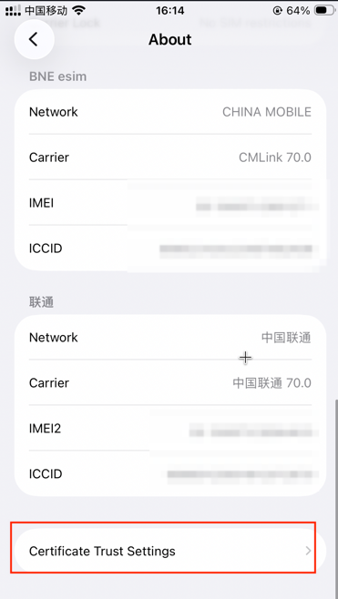 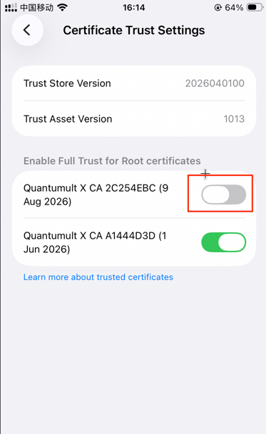

### 3. 开启重写和 MitM

返回 Quantumult X 设置页面，同时打开“重写”和 `MitM` 开关。

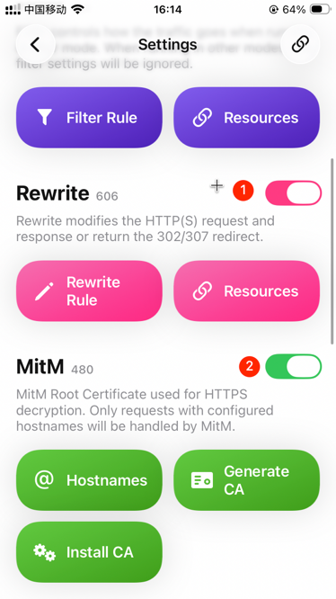

### 4. 勾选所需分流和重写
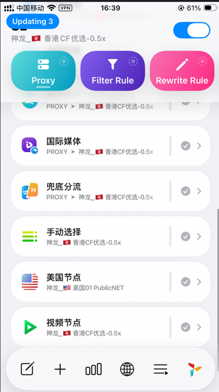 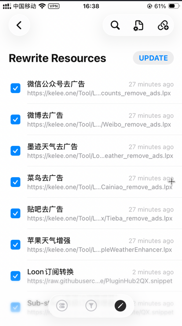 

最后回到主页面，确认右上角的总开关已经开启，让 Quantumult X 接管网络流量。随后可以重新打开常用 App，检查广告拦截效果；已经缓存的广告可能需要重启 App 或等待缓存更新后才会消失。

> 更换完整配置后，请重新检查证书信任、“重写”、`MitM` 和主开关是否仍处于开启状态。

操作流程参考：[iPhone 通过 Quantumult X 去广告教程](https://www.peterjxl.com/Phone/skip-ad-Quantumult-X#%E5%AF%BC%E5%85%A5%E8%A7%84%E5%88%99)。

---

## ✨ 核心功能与项目亮点

### 🛡️ 一键去广告，开箱即用

- 默认配置已经整合常用去广告、分流和重写规则，可以直接导入使用。
- 集中管理 App 开屏、信息流、网页、视频等场景的规则，不必到处寻找和拼接插件。
- 所有规则和最终配置公开可见，可以随时审查、增删或替换，不依赖封闭服务。

### 🤖 全自动无人值守

- GitHub Actions 每日自动运行，无需你手动操作。
- 自动拉取最新底包、同步上游规则并生成最新配置。
- 检测到变化后自动提交回你的仓库，让日常使用的配置持续更新。

### 📩 构建通知（飞书 / Telegram）

- 默认通过**飞书群机器人 Webhook** 推送，也支持 Telegram，或双通道同时发送（`notify.provider` 切换）。
- **构建成功**：显示本次下载了多少规则、哪些文件发生变化、三条链路探活结果。
- **构建失败**：直接推送错误信息，不必先去 GitHub Actions 中翻找日志。
- 配置有变化时会提醒，无变化时也会报告当前状态。
- 所选通道凭证缺失或发送失败时，自动降级到另一通道并记录日志。

### 🌏 远程规则本地化

- 自动遍历配置中的 `filter_remote` 和 `rewrite_remote` 远程链接。
- 自动将能够下载的规则文件保存到**你自己的 GitHub 仓库**。
- 自动把配置中的原始链接替换成**你仓库的 Raw 链接**。
- 降低上游链接失效、服务器限速、地址变更或 CDN 异常对配置可用性的影响。
- 下载失败时优先**继续使用仓库中的旧快照**（链接不变），仅在无任何快照时才回退原链。
- 支持 `localize_skip` 豁免名单：有 Cloudflare 防火墙、禁止服务器端抓取的源（如 kelee.one）保持原链，不计入失败。

### 🕸️ 三通道分发

- 每次构建同时产出三份链接不同、内容相同的配置：**Raw 版 / jsDelivr 镜像版 / Cloudflare Workers 反代版**。
- 构建时自动对三条链路探活，结果随通知日报推送，哪条链路失效一目了然。
- 某条链路不可达时，在 Quantumult X 中换导入另一份配置即可，无需任何手工修改。

### 🧱 自有底包

- 底包固化为本仓库的 `profiles/base.conf`，基于 [ddgksf2013 小白配置 2.0 (V269)](https://github.com/ddgksf2013/Profile) 整理，不再依赖第三方站点的实时可用性。
- 固化时已清理原配置的专属信息：作者水印/更新日志/推广注释、tag 中的 `@ddgksf2013` 后缀、其个人域名的代理分流行、免费公共订阅行、两条内容已被上游掏空的空壳规则（GoogleVoice / StreamingSE）。
- 唯一功能改动：`udp_whitelist=1-442, 444-65535` 恢复生效（避免油管/小红书去广告失效）。
- 想跟进墨鱼的后续更新：对比 [上游配置](https://ddgksf2013.top/Profile/QuantumultX.conf) 与 `profiles/base.conf`，手动合并后提交即可触发重新构建。

### 🧯 底包快照保护（url 模式）

- 底包默认走本地 `profiles/base.conf`，无外部依赖；若改回 `url` 模式跟踪上游，则享有快照保护：
- 上游底包站点失效时，自动回退到仓库中的底包快照，构建照常完成。
- 底包与快照同时失效时，构建**快速失败且不提交**，绝不用残缺配置覆盖线上。
- 提交前对输出配置做 lint 校验（策略组/分流/重写数量阈值），异常配置无法进入仓库。

### 🚀 增量配置设计

- 核心理念仍然是：**「底包 + 你的增量配置 = 最终可用配置」**。
- 只需维护一份较小的 `profiles/config.yaml`，只写你与底包不同的部分。
- 不需要反复复制粘贴或手动维护几千行完整配置。
- 更新底包时重新注入你的自定义规则、策略、节点和重写，保留个性化设置。

### 🧹 智能清洗底包

- 支持按关键词删除底包中不需要的内容。
- 可以清理不需要的策略组、DNS 或分流规则，让最终配置更精简。
- 同时支持黑名单和白名单两种过滤策略。

### 🎯 灵活控制规则优先级

- 自定义远程分流和重写规则会优先插入，确保个性化规则具有更高匹配优先级。
- 本地分流支持两种位置模式：
  - `top`：插入最前面，适合需要优先匹配的自定义规则。
  - `bottom`：插入最后面，适合 GeoIP、兜底等低优先级规则。

### 🔍 更多实用能力

- **策略映射**：把第三方规则中的策略名（例如 `us-node`）自动替换成你自己的策略组名称。
- **MITM 智能追加**：合并底包与自定义 Hostname，避免直接覆盖原有 MITM 配置。
- **模块化管理**：支持通过 `file://` 把分流、重写和 Hostname 拆分到独立文件中维护。
- **KV 配置覆盖**：按需覆盖 `general`、`mitm`、`http_backend` 等配置项。
- **下载重试与镜像切换**：每个远程文件自动重试；`raw.githubusercontent.com` 源失败自动切换 jsDelivr 镜像再试。
- **内容校验**：空文件、HTML 错误页会被识别并拒绝写入快照，防止坏内容覆盖好规则。
- **下载间隔保护**：每次下载后等待 1 秒，降低请求过于频繁而被上游限制的概率。
- **单项失败兼容**：某个远程文件下载失败时保留可用链接并继续构建，不让单个上游故障拖垮整份配置。
- **多配置输出**：同时生成保留原始链接的 `QuantumultX.conf`（调试参考）和三条分发通道的本地化配置。

---

## 📂 项目结构

```yaml
QuantumultX/
├── .github/workflows/
│   └── build.yml              # GitHub Action 自动构建配置
├── profiles/
│   ├── base.conf              # 自有底包（ddgksf2013 V269 固化 + 专属信息清理）
│   └── config.yaml           # 👈 你的核心配置文件（改这里！）
├── images/                   # README 使用的 Quantumult X 操作截图
├── rules/                     # 存放本地化后的规则文件
│   ├── custom.list        # 自定义分流（个人规则/番茄小说去广告等）
│   ├── dev.list           # 开发者工具分流（Cursor/Trae 等）
│   ├── filter_remote/        # 本地化后的远程分流规则
│   └── rewrite_remote/       # 本地化后的远程重写规则
├── src/
│   ├── main.py               # 主程序入口
│   ├── qx_core.py            # 核心处理逻辑
│   └── notify.py             # 通知模块（飞书/Telegram）
├── QuantumultX.conf        # [生成] 原始远程链接配置（调试参考）
├── QuantumultX_Local.conf  # [生成] Raw 通道配置（推荐使用）
├── QuantumultX_Mirror.conf # [生成] jsDelivr 镜像通道配置
├── QuantumultX_CF.conf     # [生成] Cloudflare Workers 反代通道配置
└── README.md
```

---

## ⚙️ 本地构建（开发与调试）

如果你想在自己电脑上运行：

### 1. 环境准备

*   Python 3.9+
*   安装依赖：

```bash
pip install -r requirements.txt
```

### 2. 运行构建
```bash
python src/main.py
```

### 3. 获取结果
生成了**四份配置文件**，都可以直接导入 Quantumult X 使用：

| 配置文件 | 分发链路 | 说明 |
|---------|---------|------|
| `QuantumultX.conf` | 上游原始链接 | 只合并不本地化，用于调试比对 |
| `QuantumultX_Local.conf` | GitHub Raw | **主通道**，规则快照全部在本仓库 |
| `QuantumultX_Mirror.conf` | jsDelivr CDN | 镜像通道，Raw 直连不稳时使用 |
| `QuantumultX_CF.conf` | Cloudflare Workers | 自建反代通道，前两者失效时使用 |

> 💡 三份本地化配置内容完全相同，仅链接前缀不同。哪个链路在你的网络环境下可达就用哪个；Telegram 日报会推送每条链路的探活结果。

---

## 📝 完整配置说明（逐段解释 `config.yaml`）

`profiles/config.yaml` 是你唯一需要维护的文件，下面逐段解释每一部分怎么用：

### 🔹 `base` - 底包（必须）
```yaml
base:
  file: "profiles/base.conf"    # 本地底包（默认，随仓库版本管理，无外部依赖）
  # url: "https://ddgksf2013.top/Profile/QuantumultX.conf"  # 改为跟踪上游时启用（带快照回退）
```
**作用**：你的整个配置基于这个"底包"来修改，你只需要增量修改它。

- 默认使用仓库内的 `profiles/base.conf`（基于 ddgksf2013 小白配置 2.0 V269 固化，已清理原作者专属信息并恢复 udp_whitelist，详见文件头注释）。
- 想跟进上游更新：对比上游最新配置与 `base.conf` 手动合并；或注释 `file`、启用 `url` 回到跟踪模式（上游失效时自动回退仓库快照）。

---

### 🔹 `notify` - 通知通道（可选）
```yaml
notify:
  provider: "feishu"   # feishu（默认）| telegram | both
```
**作用**：构建结果推送到飞书群机器人（默认）或 Telegram，也可双通道同发。环境变量 `NOTIFY_PROVIDER` 优先级更高；所选通道凭证缺失时自动降级另一通道。凭证配置见上方 Secrets 表格。

---

### 🔹 `patches` - 清洗底包（可选）
```yaml
patches:
  policy:
    keywords:
      - "Hijacking"   # 删除所有名字里带 "Hijacking" 的策略组
      - "广告"         # 删除所有名字里带 "广告" 的策略组
```
**作用**：在注入你的配置之前，先把底包里**你不想要的内容删掉**，让配置更干净。

**用法**：
- `patches.策略组名称`：你要清洗哪个段落（比如 `policy` 就是策略组段落）
- `keywords`：列出你要删除的内容包含的关键词

---

### 🔹 `general` - 全局设置（可选）
```yaml
general:
  geoip-url: "https://github.com/Hackl0us/GeoIP2-CN/raw/release/Country.mmdb"
  resource_parser_url: "https://raw.githubusercontent.com/KOP-XIAO/QuantumultX/master/Scripts/resource-parser.js"
```
**作用**：这里配置 Quantumult X 的全局参数，会**强制覆盖**底包里的对应参数。

常用配置：
- `geoip-url`: 更新 GeoIP 数据库（解决底包数据过时问题）
- `resource_parser_url`: 资源解析器地址
- `server_check_url`: 节点测速地址

---

### 🔹 `dns` - 自定义 DNS（可选）
```yaml
dns:
  - "server=/example.com/192.168.1.1" # 你的内网域名走内网 DNS
```
**作用**：添加自定义 DNS 规则。

---

### 🔹 `policy_map` - 策略组映射（必须）
```yaml
policy_map:
  us-node: "美国节点"      # 外部规则叫 us-node → 实际走你配置的「美国节点」策略组
  direct: "direct"
  reject: "reject"
```
**作用**：当你引用第三方远程规则时，第三方规则里的策略名需要映射到你自己的策略组名字，这里就是做这个映射的。

**用法**：`"第三方规则里的名字": "你自己策略组的名字"`

---

### 🔹 `policy` - 自定义策略组（必须）
```yaml
policy:
  # 1. 自动测速分组：定期自动选延迟最低的节点
  - "url-latency-benchmark=香港节点, server-tag-regex=(?=.*(港|HK|(?i)Hong))^((?!(台|日|韩|新|美)).)*$, check-interval=900, tolerance=0, img-url=https://raw.githubusercontent.com/Orz-3/mini/master/Color/HK.png"

  # 2. 静态分组：固定包含这些节点/策略
  - "static=苹果服务, direct, 香港节点, 台湾节点, 美国节点, img-url=..."
```
**作用**：这里定义你自己的所有策略组，这是配置的核心部分。

两种类型：
- `url-latency-benchmark=`：自动测速分组，根据延迟自动选择最优节点
- `static=`：静态分组，你手动指定包含哪些节点/其他策略

参数说明：
- `server-tag-regex=正则表达式`：自动从你的订阅里匹配符合规则的节点
- `check-interval=900`：测速间隔，单位是秒（900秒 = 15分钟）
- `img-url=`：策略组图标链接

---

### 🔹 `server_remote` - 节点订阅（可选）
```yaml
server_remote:
  - "https://你的机场订阅链接, tag=我的机场, enabled=true"
```
**作用**：需要代理分流时，填写你自己的节点订阅链接，Quantumult X 会自动拉取节点。项目本身不提供代理节点；如果你只使用去广告或直连规则，可以不填写。

> **推荐做法**：不要把订阅链接写进配置文件，而是在 Quantumult X App 的「订阅」区自行添加机场订阅。本配置的策略组全部使用 `server-tag-regex` 正则分组（香港/台湾/日本/美国等），能自动匹配任意机场的节点名，App 内换机场无需改配置。底包自带的免费公共订阅（freeSub）默认会被 `patches.server_remote` 清洗移除。

> 请勿把带有 Token 的私人订阅地址提交到公开仓库。

---

### 🔹 `local_filters` - 本地分流规则（可选）
```yaml
local_filters:
  top:
    - "file://rules/custom.list"  # 从本地文件读取规则
    - "ip6-cidr,::/0,direct"           # 或者直接写在这里
  bottom:
    - "geoip,cn,direct"
```
**作用**：添加你自己的本地分流规则。

位置说明：
- `top`：插到**所有分流规则最前面**，优先级最高（适合你自己的规则优先匹配）
- `bottom`：插到**所有分流规则最后面**，优先级最低（适合兜底规则）

格式说明：
- `file://路径`：从 `rules/` 目录下读取文件，方便你把大量规则分开管理

---

### 🔹 `filter_remote` - 远程分流规则（可选）
```yaml
filter_remote:
  - name: "TikTok"
    source: "blackmatrix7" # 内置简写，自动生成正确链接
    policy: "us-node"      # 这些分流走哪个策略
    tag: "TikTok"
```
**作用**：引用第三方远程分流规则。

支持内置简写：`source: "blackmatrix7"` 会自动拼接正确的规则地址，不用你记长链接。

---

### 🔹 `rewrite_local` - 本地重写（可选）
```yaml
rewrite_local:
  - "file://rules/rewrites.list" # 从本地文件读取
  - "^https://google.cn url 302 https://google.com" # 直接写在这里
```
**作用**：添加你自己的本地重写规则（重写用来做去广告、修改响应、跳转等）。

---

### 🔹 `rewrite_remote` - 远程重写（推荐添加）
```yaml
rewrite_remote:
  - "https://limbopro.com/Adblock4limbo.conf, tag=毒奶特供(去网页广告计划), enabled=true"
```
**作用**：引用第三方远程重写规则（一般用来去广告）。

本工具会**自动下载这些文件到你自己仓库**，并替换链接为你的仓库地址，不怕原链接失效。

---

### 🔹 `localize_skip` - 本地化豁免名单（可选）
```yaml
localize_skip:
  - "kelee.one"
```
**作用**：URL 命中关键字的远程引用**保持原链**（由 Quantumult X 客户端直接拉取），不参与本地化，也不计入下载失败统计。

**场景**：部分规则源（如 kelee.one）开启了 Cloudflare 防火墙，禁止服务器端抓取（请求一律 403），这类源无法快照，只能保持原链让客户端直连。

---

### 🔹 `task_local` - 定时任务（可选）
```yaml
task_local:
  - "0 9 * * * https://example.com/sign.js, tag=每日签到"
```
**作用**：添加 Quantumult X 定时任务（比如自动签到）。

---

### 🔹 `mitm` - MITM 配置（可选）
```yaml
mitm:
  hostname: "file://rules/mitm_hosts.list"
```
**作用**：配置 HTTPS 解密需要的域名列表。

> 💡 提示：如果域名很多，建议放在 `rules/` 目录下的单独文件里引用，不要直接写在 `config.yaml` 里，更干净。

---

## 📚 Quantumult X 教程与参考资料

如果你是第一次使用 Quantumult X，或者希望进一步了解策略组、分流、重写和 MITM，可以参考以下资料：

1. [解析器作者的 Quantumult X 不完全教程](https://www.notion.so/kopshawn/Quantumult-X-1d32ddc6e61c4892ad2ec5ea47f00917)

   适合系统了解 Quantumult X 的基础概念、配置方式和常见用法。

2. [Quantumult X Wiki Book](https://qx.atlucky.me/)

   社区整理的 Quantumult X Wiki，可用于查询各项功能和配置说明。

3. [Quantumult X 作者 GitHub 示例文档](https://github.com/crossutility/Quantumult-X/blob/master/sample.conf)

   面向熟悉 Quantumult X 的用户，可直接查阅作者提供的完整示例配置和参数写法。

4. [KOP-XIAO 示范配置和说明](https://raw.githubusercontent.com/KOP-XIAO/QuantumultX/master/QuantumultX_Profiles.conf)

   一份可直接参考的示范配置，包含较完整的配置结构和注释说明。

---

## ❓ 常见问题

### Q: 这个项目提供代理节点吗？
A: 不提供。它提供的是 Quantumult X 去广告配置、规则和自动更新工具。需要代理分流时，请使用自己的合法节点订阅（推荐在 App 的「订阅」区自行添加，不要写进配置文件），并注意保护订阅地址中的 Token。

### Q: 三份本地化配置（Local/Mirror/CF）该导入哪个？
A: 内容完全相同，任选可达的即可：
- 默认用 **Local**（GitHub Raw）；
- Raw 打不开就换 **Mirror**（jsDelivr 镜像）；
- 都不稳就用 **CF**（Cloudflare Workers 反代）。
每次构建后的通知日报会附上三条链路的探活结果。已在 QX 中使用旧链接的，换导入新链接后记得删除旧的远程配置引用。

### Q: 每次更新配置都需要重新生成 MITM 证书吗？
A: **不需要。** MITM 证书在 Quantumult X App 内生成后保存在手机和描述文件里，远程配置更新不会动它。只有配置里内嵌了另一张证书（passphrase/p12 行）才会顶掉本地证书——本项目的构建流程已强制清洗任何证书数据（`patches.mitm`），配置永不携带证书。所以：证书只需在 App 内生成安装一次，之后日常自动更新无需任何操作。
> 注意：不要使用他人分享的证书/描述文件（等同于把 HTTPS 私钥交给对方）。

### Q: 为什么导入后仍然能看到部分广告？
A: 去广告规则无法保证覆盖所有 App 和版本。请先确认对应重写已启用；涉及 HTTPS 内容时，还要安装并信任 Quantumult X 的 MITM 证书。若设置无误，可能是 App 更新后接口发生变化，需要等待上游规则更新。

### Q: 什么是「规则本地化」？为什么需要这个？
A: 很多去广告规则会持续更新，但原链接有时会限速、变更或失效。本地化会把能够下载的规则保存到**你自己的 GitHub 仓库**，让 Quantumult X 优先从自己的仓库拉取，降低上游单点故障带来的影响。

### Q: 多久自动构建一次？
A: 默认是每天北京时间早上 6 点自动构建一次，保证你拿到最新规则。你也可以随时手动构建。

### Q: 构建完了怎么在 Quantumult X 使用？
A: 三份本地化配置任选可达的一条链路：
- Raw：`https://raw.githubusercontent.com/gclm/QuantumultX/main/QuantumultX_Local.conf`
- 镜像：`https://testingcf.jsdelivr.net/gh/gclm/QuantumultX@main/QuantumultX_Mirror.conf`
- CF 反代：`https://你的Worker域名/https://raw.githubusercontent.com/gclm/QuantumultX/main/QuantumultX_CF.conf`

打开 Quantumult X → 配置 → 下载配置 → 填入链接 → 导入就可以用了。

### Q: 以前的旧版本配置（Surge/Clash、签到脚本等）去哪了？
A: 旧的多端手工配置仓库（gclm/QuantumultX）已归档为 **v1.0 分支**（`https://github.com/gclm/QuantumultX/tree/v1.0`），不再维护。其中有价值的规则（AI 分流、Cursor/Trae、番茄小说去广告）已迁移进本仓库统一自动构建。

### Q: 为什么配置好后收不到通知？
A: 按通道检查：
1. **飞书**（默认）：`FEISHU_WEBHOOK_URL` 是否正确；机器人安全设置若为「自定义关键词」，关键词需包含 `QX`（通知文案已内置）；若为「签名校验」，`FEISHU_SECRET` 必须填写
2. **Telegram**：Bot Token 和 Chat ID 是否正确；需要先给你的 Bot 发一条消息
3. 检查 `notify.provider` 配置与 GitHub Secrets 名字是否正确、不能有空格

### Q: 构建失败了怎么办？
A: 通知（飞书/Telegram）会推送构建失败消息和错误原因。你可以去 GitHub → Actions → 最新一次运行那里看完整日志。大部分情况是：
1. 你的 `config.yaml` 格式错了（YAML 对缩进要求严格，仔细检查）
2. 某个远程链接下载失败（一般重试一次就好，或者换个链接）

---

## 📊 当前版本更新日志

*   ✅ **仓库迁移**：项目迁移至 `gclm/QuantumultX`，原多端手工配置归档为 v1.0 分支；qx-config-sync（suversal）仓库不再使用
*   ✅ **飞书通知（默认）**：新增飞书群机器人 Webhook 推送，支持加签；`notify.provider` 可切换 feishu / telegram / both，凭证缺失自动降级
*   ✅ **自有底包**：ddgksf2013 V269 固化为 `profiles/base.conf`，清理原作者水印/更新日志/专属分流/免费订阅/空壳规则，恢复 `udp_whitelist` 生效
*   ✅ **MITM 证书保护**：构建强制清洗任何 `passphrase`/`p12` 行，配置永不携带证书；App 内一次生成，日常更新无需重新安装
*   ✅ **三通道分发**：每次构建产出 Raw / jsDelivr 镜像 / Cloudflare Workers 反代三份配置，自动探活并随日报推送
*   ✅ **底包快照保护**：url 模式下上游底包失效自动回退仓库快照，快照也失效则拒绝提交，杜绝空配置覆盖线上
*   ✅ **下载重试与镜像切换**：远程规则自动重试，raw 源失败自动切换 jsDelivr 源
*   ✅ **内容校验**：拒绝空文件和 HTML 错误页写入规则快照
*   ✅ **提交前 lint**：策略组/分流/重写数量阈值校验，残缺配置无法进入仓库
*   ✅ **本地化豁免名单**：`localize_skip` 支持 CF 防火墙源保持原链
*   ✅ **规则整合**：迁入 AI 分流（OpenAI/Claude/Copilot）、Cursor/Trae、番茄小说去广告等自定义规则
*   ✅ **节点订阅治理**：订阅链接不进仓库，App 内自管；清洗底包自带免费订阅
*   ✅ Telegram 通知增强：下载成功/旧快照/失败/豁免计数、异常文件清单、通道探活结果
*   ✅ Workflow 现代化：actions v5、Python 3.12、并发保护

---

## 👍 感谢各方分享

本项目配置中使用了以下大佬分享的底包、规则和资源，在此特别感谢：

*   **底包**: [ddgksf2013](https://github.com/ddgksf2013) - 提供了非常完善的 Quantumult X 基础配置
*   **分流规则**: [blackmatrix7](https://github.com/blackmatrix7/ios_rule_script) - 维护了完整全面的去广告和分流规则
*   **去广告**:
    *   [limbopro](https://github.com/limbopro/Adblock4limbo) - 毒奶特供去网页广告计划
    *   [blackmatrix7](https://github.com/blackmatrix7/ios_rule_script) - 多种应用去广告规则
    *   [keleecn](https://github.com/keleecn) - 提供了多款国内 App 去广告 Loon 规则（兼容 QX）
*   **工具**:
    *   [Peng-YM](https://github.com/Peng-YM/Sub-Store) - 高级订阅管理器
    *   [iab0x00](https://github.com/iab0x00/ProxyRules) - PluginHub 转换规则
*   **图标资源**:
    *   [Orz-3](https://github.com/Orz-3/mini) - 极简风格图标
    *   [Koolson](https://github.com/Koolson/Qure) - 彩色风格图标
    *   [ddgksf2013](https://github.com/ddgksf2013) - 应用图标
 
 ## Contact

如果你在使用过程中遇到问题，欢迎提 [Issue](https://github.com/gclm/QuantumultX/issues)。

---

## 致谢
感谢各位规则大佬分享的规则，也感谢前辈们的思路让这个项目更完善。
